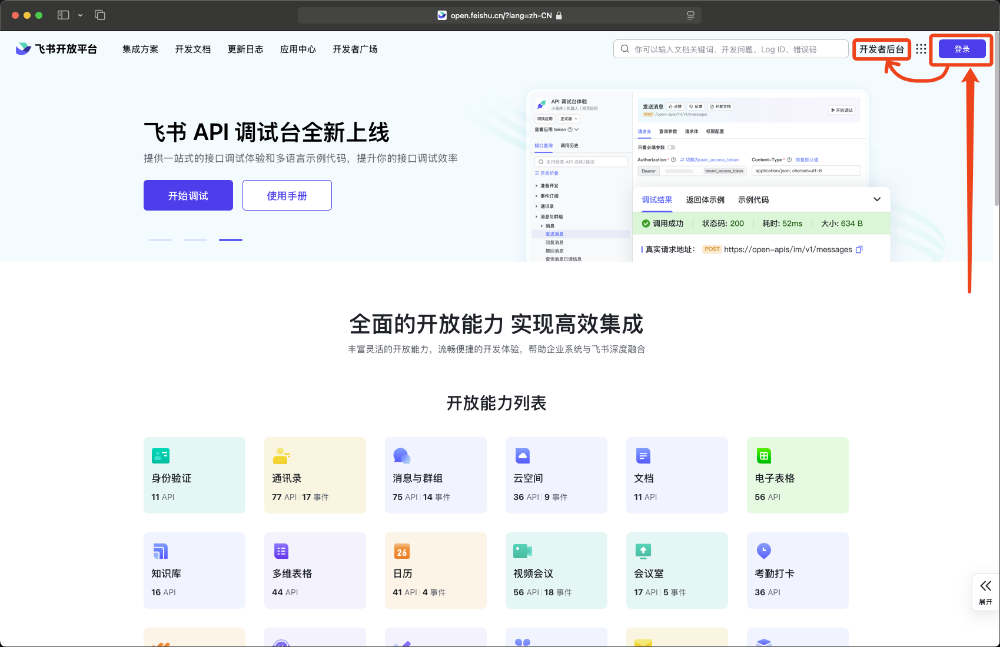
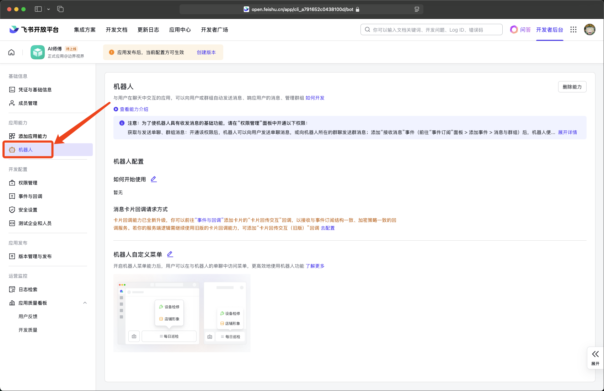
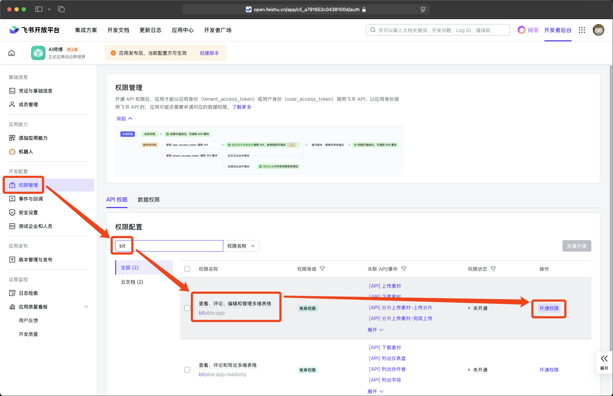
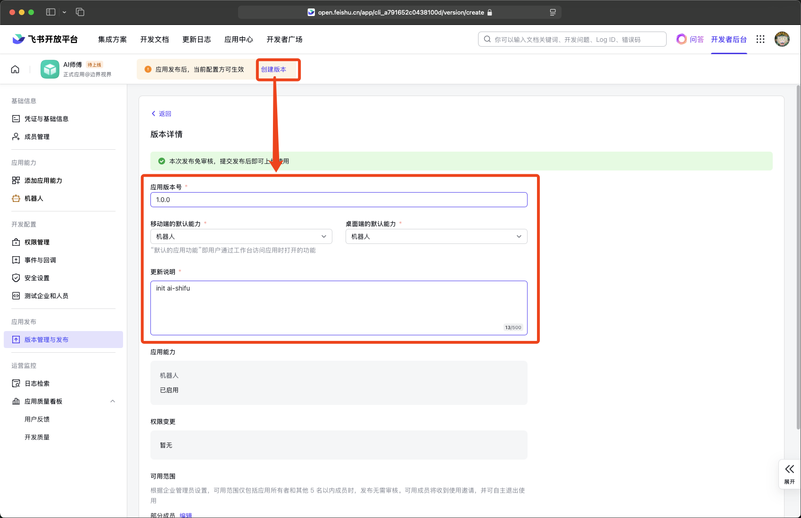
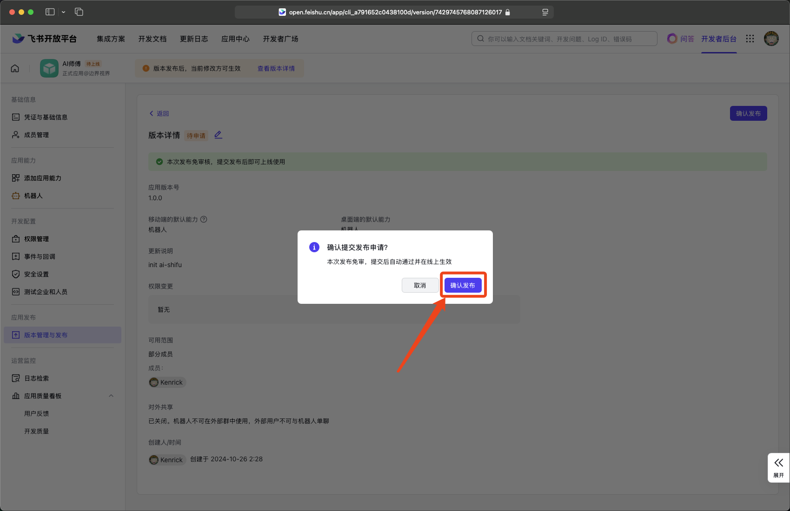
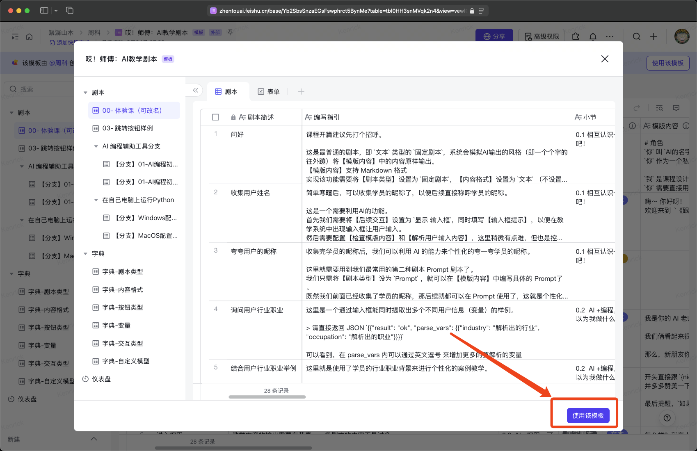
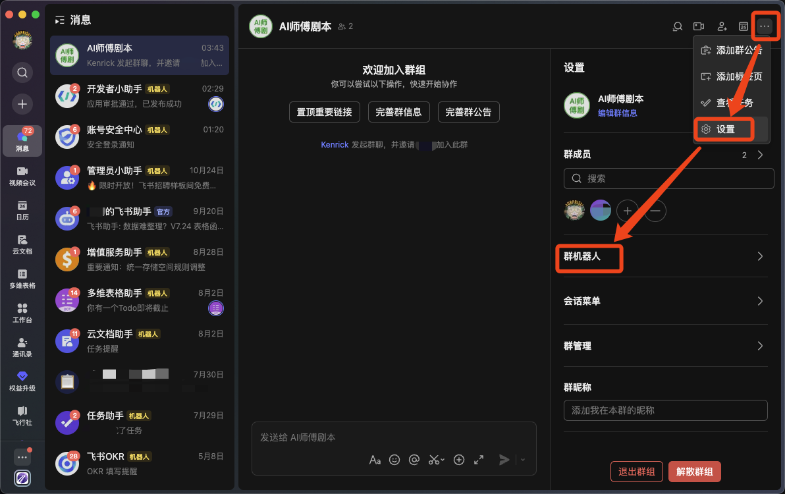
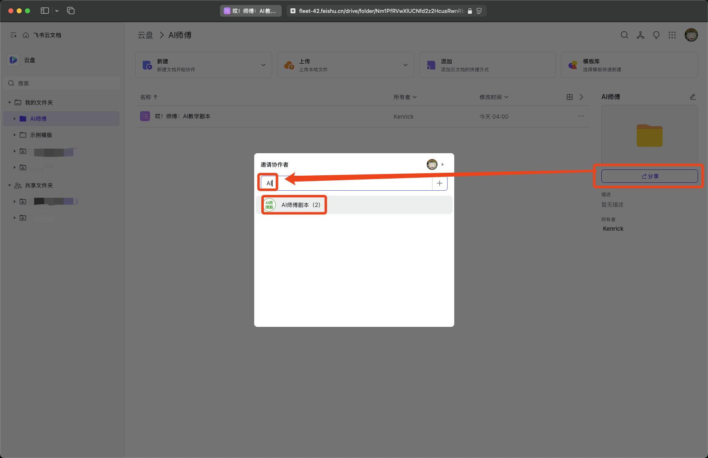
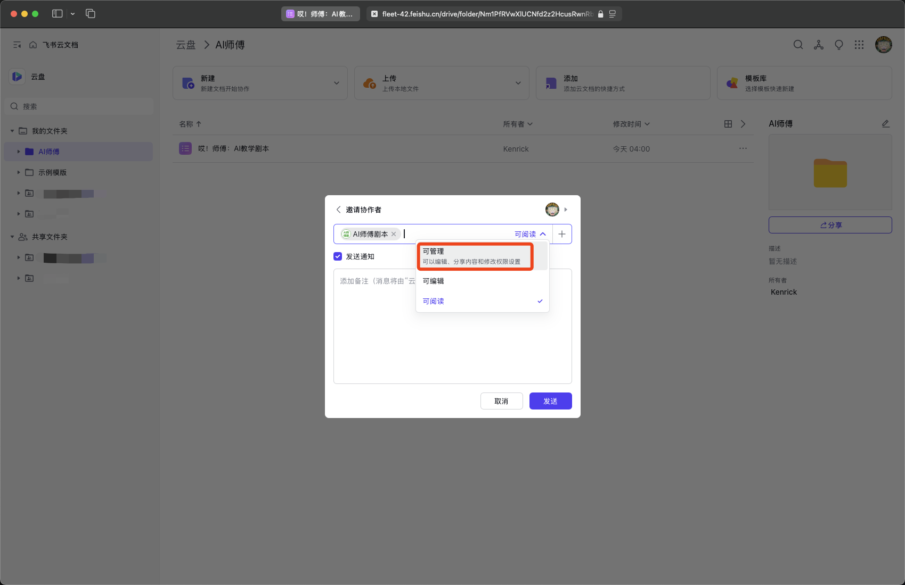

# 部署前的准备工作

目前 AI师傅（AI-Shifu）自有的剧本编辑调试工具还在设计阶段，作为创业团队，在时间和资源有限的情况下，我们选择践行敏捷和精益的思想 -- 使用飞书的多维表格作为我们的剧本载体

因此，我们的准备工作有以下两部分：
* [**飞书应用准备及配置**](#飞书应用的准备及配置)
* [**AI师傅剧本（即飞书多维表格）的准备及配置**](#AI师傅剧本的准备及配置)

## 飞书应用的准备及配置

我们需要在 `飞书开放平台` 中创建一个飞书应用，以便在系统中能够对相应的剧本文档进行操作

### Step01: 登录飞书开放平台

☞ https://open.feishu.cn

### Step02: 创建 `企业自建应用`

### Step03: 填写应用必要信息

* 应用名称： AI师傅
* 应用描述： 用于AI师傅操作飞书多维表格

### Step04: 添加应用能力

创建完应用后，默认会跳转到 `添加应用能力` 页面，如若没有跳转，可以点击左侧导航 `应用能力` 下面的 `添加应用能力`

我们只需添加 `机器人` 这一项能力即可

点击添加后，`应用能力` 下面的出现了 `机器人` 这一项能力即代表添加成功。此时我们不需要做任何其他配置。

### Step05: 添加必要权限

* 点击左侧导航中的 `权限管理`
* 在搜索框中搜索 `bit`
* 找到权限 `查看、评论、编辑和管理多维表格`
* 点击右侧的 `开通权限`
* 由于我们开通的是免审权限，此时权限状态应该是 $${\color{green}•已开通}$$

### Step06: 发布应用

要使当前应用及其配置生效还需要创建版本并发布才可以。
* 点击顶部提示中的 `创建版本`
* 填写必要信息
  * 版本号： 1.0.0
  * 更新说明： init ai-shifu
  * xx端默认能力： 默认勾选了 `机器人` 不用动

点击底部的 `保存` 按钮

如果你是管理员，那会立刻跳转到发布页面并弹出确认发布对话框，此时点击确认发布即可。 如果你不是管理员，则通知管理员审核发布。

### Step07: 妥善保存应用凭证

🎉恭喜你，已经完成飞书应用的准备工作了，请妥善保管好该应用的 ID 和 Secret

后续部署系统时，需要将其填写到 docker/.env 文件中的 `LARK_APP_ID` 和 `LARK_APP_SECRET` 变量中

----

## AI师傅剧本的准备及配置

整套系统部署完成但没有任何剧本也是无法体验系统的能力的，同时为了大家能够更好的发挥创造，因此制作了 AI师傅 的剧本模版，可以通过模版创建自己的文档，并将其绑定到系统中进行使用。 熟悉系统后就可以进一步的创造属于自己的AI课程了

### Step01: 从模版创建剧本

☞ https://zhentouai.feishu.cn/base/Yb2SbsSnzaEGsFswphrct5BynMe?table=tbl0HH3snMVqk2n4&view=vewlGkI2Jp

直接点击右下角的 `使用该模版` 就可以将其复制到你自己的飞书云盘中了，之后你可以随意调整文档名称和位置

此时页面先不要关闭，后面会用到该文档的 URL 链接

### Step02: 让系统有能力操纵剧本

打开 飞书App 新建群

创建 `对话` 群，群名称：AI师傅剧本，随便添加一人进群即可

点击右上角的 `设置` 并选择 `群机器人`

点击 `添加机器人` 然后选择我们之前创建好的机器人 `AI师傅`

然后将刚才新建剧本文档的 URL 链接复制后发送到群内，在群中链接将以文档卡片的形式展现，此时我们需要将本群成员对该文档的权限改为 `可管理`

🎉恭喜你，系统已经可以操作该文档啦

### Step03: 进阶：让系统更便捷的操作更多剧本文件

你是不是觉得每次都将文档发到有 `AI师傅` 机器人的群内并修改权限是一件很麻烦的事情？

放心，我们还有更便捷的方式，能让系统可以操作更多的剧本文档
* 首先，你需要做的是在飞书云盘中创建一个文件夹，
* 然后进入该文件夹，并点击该文件夹的 `分享` 按钮
* 搜索 AI，找到我们刚才已经创建好的群组 `AI师傅剧本`，将其加入协作者中

最后修改其权限为 `可管理`， 点击发送/完成后就大功告成了，此后所有该文件夹内的剧本文档就都可以被系统操作了

